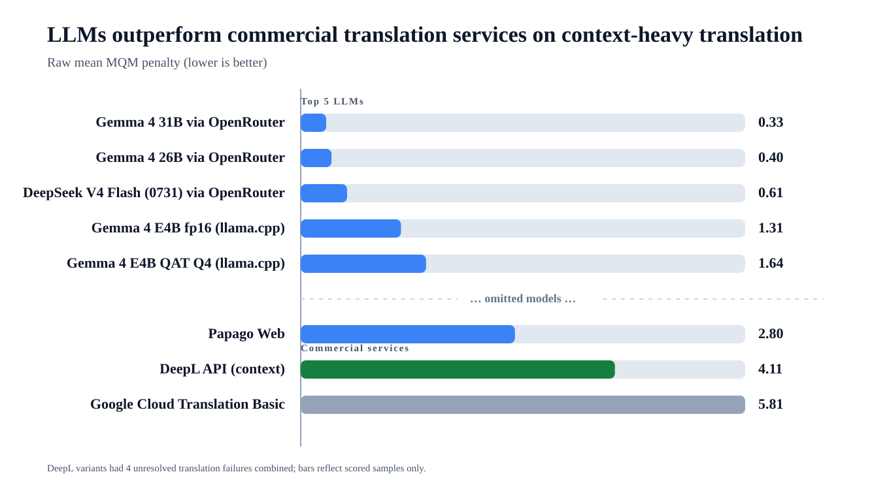

# Korean Multi-turn Context Translation Benchmark

A Korean multi-turn context translation benchmark comparing LLM systems with conventional commercial translation services, evaluated with GEMBA-MQM-based judging. Korean conversational utterances (1–3 prior context turns) are translated into English, Japanese, and Simplified Chinese, testing both required-context recovery and irrelevant-context rejection.

Results are published as a series of experiments on the same frozen dataset. Each experiment uses its own prompt, judge, and participant set, so scores are only comparable within one experiment.

## Current Experiment (2026-08)

[experiments/2026-08-issue1-milmmt-e4b-papago-deepseek-0731/](experiments/2026-08-issue1-milmmt-e4b-papago-deepseek-0731/) — local Gemma 4 E4B deployment variants and MiLMMT-46-4B arms vs Gemma 4 31B/26B, DeepSeek V4 Flash 0731, Papago, DeepL, and Google, all on the canonical PuriPuly translation prompt (MiLMMT native arm excepted).

- **Gemma 4 31B leads overall (0.333)**, ahead of Gemma 4 26B (0.403) and DeepSeek V4 Flash 0731 (0.606).
- **DeepSeek V4 Flash 0731 is the best system on Simplified Chinese** (0.327 common-cell) and misses required context on only 1.9% of samples.
- **Papago Web is the strongest traditional MT service (2.801)**, ahead of DeepL (4.107) and Google Cloud Translation Basic (5.810) — but context-blind (24.5% missed required context).
- **Local Gemma 4 E4B degrades with quantization** (fp16 1.311 → QAT Q4 1.639 → QAT Q2 collapses at 9.460), and **MiLMMT 46-4B fails in both prompt regimes** (native prompt 2.949 with 24.1% missed context; PuriPuly policy prompt 11.500 with 25.5% misused context).

Primary score: raw mean penalty, lower is better.



| Rank | System | Mean penalty | Scored samples | Note |
| ---: | --- | ---: | ---: | --- |
| 1 | Gemma 4 31B (OpenRouter) | 0.333 | 648 | Fully valid |
| 2 | Gemma 4 26B A4B (OpenRouter) | 0.403 | 648 | Fully valid |
| 3 | DeepSeek V4 Flash 0731 (OpenRouter) | 0.606 | 648 | Fully valid |
| 4 | Gemma 4 E4B fp16 (llama.cpp, local) | 1.311 | 647 | 1 judge failure |
| 5 | Gemma 4 E4B QAT Q4 (llama.cpp, local) | 1.639 | 648 | Fully valid |
| 6 | Papago Web | 2.801 | 648 | Context-blind |
| 7 | MiLMMT 46-4B X0 native prompt | 2.949 | 648 | Sentence-level prompt |
| 8 | DeepL API | 4.107 | 643 | 4 unresolved + 1 judge failure |
| 9 | Google Cloud Translation Basic | 5.810 | 648 | Context-blind |
| 10 | Gemma 4 E4B QAT Q2 (llama.cpp, local) | 9.460 | 631 | 17 judge failures |
| 11 | MiLMMT 46-4B X2 PuriPuly policy | 11.500 | 648 | Fully valid |

The run reports `benchmarkValid: false` (19 judge failures, 4 unresolved DeepL cells); the common-cell view (625 cells) preserves the full ordering.

## Previous Experiment (2026-04)

[experiments/2026-04-gemini-context-v2/](experiments/2026-04-gemini-context-v2/) — Gemini 3.1 Flash-lite led (0.573) with context-aware LLMs beating commercial services, and context use beating no-context baselines. It used a different prompt (`gemini-context-v2.md`) and judge (`gemini-3.1-pro-preview`), so its scores are **not directly comparable** with 2026-08.

## Dataset

`gemba-mqm-context-v1`: 216 Korean source items × 3 target languages, frozen at fingerprint `9ab9e987…5110`. Runtime data: `data/datasets/gemba-mqm-context-v1/runtime.json`; authoring assets alongside.

## Reproduction

```bash
npm install && cp .env.example .env
npm run bench:cli -- \
  --benchmark-config data/benchmarks/gemba-mqm-context-v1-milmmt-e4b.json \
  --participants gemma4-31b,gemma-4-26b-openrouter,deepseek-v4-flash-0731-openrouter \
  --judge-model google/gemini-3.7-flash:batch \
  --judge-backend openrouter-batch
```

Full reruns need provider APIs, credentials, local llama.cpp servers, and a judge model. See `docs/reproducibility.md`.

## Documentation

- `experiments/2026-08-issue1-milmmt-e4b-papago-deepseek-0731/README.md` — current experiment details
- `docs/methodology.md` — benchmark design and experiment comparison
- `docs/results.md` — detailed result analysis
- `docs/evaluation.md` — GEMBA-MQM-based judging
- `docs/dataset.md` — dataset schema and authoring
- `docs/limitations.md` — interpretation limits
- `docs/reproducibility.md` — setup and runner instructions

## License

Code written for this benchmark is licensed under MIT. Dataset and public report artifacts are licensed under CC BY 4.0; see `data/LICENSE`. Vendored third-party material under `vendor/` keeps its original upstream license; see `docs/third-party-notices.md`.
