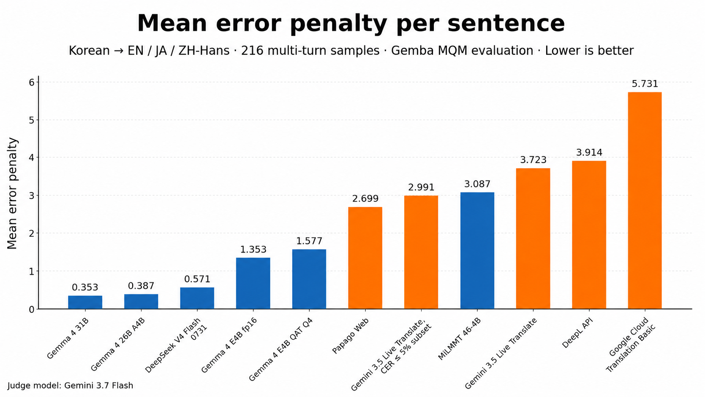
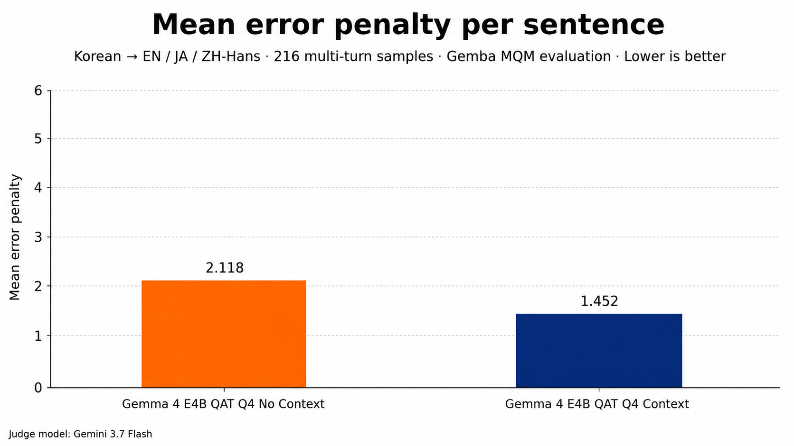

# Korean Multi-turn Context Translation Benchmark

GEMBA-MQM-based benchmark for Korean multi-turn context translation — LLMs vs. commercial translation services, including audio-native speech-to-speech translation.

- Korean conversational utterances (1–3 prior context turns) translated into English, Japanese, and Simplified Chinese
- Tests both required-context recovery (referents, ellipsis, register) and irrelevant-context rejection (topic shifts, false leads)
- A series of experiments on one frozen dataset — each experiment has its own prompt, judge, and participants, so **scores are not comparable across experiments**

## Current Experiment (2026-08)

- **Full details:** [Here](experiments/2026-08-gemini35-live-10p-highjudge/)
- **Setup:** Gemini 3.5 Live Translate (audio-native, two-voice TTS) vs. the 2026-08 text/MT field — Gemma 4 31B/26B, DeepSeek V4 Flash 0731, local Gemma 4 E4B arms (fp16/QAT Q4), MiLMMT 46-4B X0, Papago/DeepL/Google. All rows judged by Gemini 3.7 Flash (batch) with high reasoning effort; all translations are fork-reused from the issue-1 run, all cells are freshly judged

**Key findings:**

- LLMs outperform traditional MT on multi-turn casual dialogue — best LLM 0.35 (Gemma 4 31B) vs. best MT Papago 2.70
- Context helps: same Gemma 4 E4B QAT Q4 improves 31.5% with full history + policy (1.45 vs. 2.12 sentence-only, same high-effort judge; see `ablation/` appendix)
- Google Translate is competitive for en (1.22) and zh-Hans (2.49) but collapses on ja (13.49), driving its overall 5.73
- Quantization costs quality for the small local model: Gemma 4 E4B fp16 1.35 → QAT Q4 1.58



Primary score: raw mean penalty — lower is better.


| Rank | System                                     | Mean penalty | Samples |
| ----: | ------------------------------------------ | ------------: | -------: |
| 1    | Gemma 4 31B                                | 0.353        | 648     |
| 2    | Gemma 4 26B A4B                            | 0.387        | 648     |
| 3    | DeepSeek V4 Flash 0731                     | 0.571        | 648     |
| 4    | Gemma 4 E4B fp16                           | 1.353        | 648     |
| 5    | Gemma 4 E4B QAT Q4                         | 1.577        | 648     |
| 6    | Papago Web                                 | 2.699        | 648     |
| 7    | MiLMMT 46-4B                               | 3.087        | 647     |
| -    | Gemini 3.5 Live Translate, CER ≤ 5% subset | 2.991        | 223     |
| 8    | Gemini 3.5 Live Translate                  | 3.723        | 638     |
| 9    | DeepL API                                  | 3.914        | 642     |
| 10   | Google Cloud Translation Basic             | 5.731        | 648     |


### Context ablation — sentence-only vs. policy + full history



Full slices in [ablation/](experiments/2026-08-gemini35-live-10p-highjudge/ablation/) · paired n=642 (B wins 236 vs. 134, tie 272)


| Condition                     | Mean penalty | Samples |
| ----------------------------- | ------------: | -------: |
| Gemma 4 E4B QAT Q4 Context    | 1.452        | 642     |
| Gemma 4 E4B QAT Q4 No Context | 2.118        | 642     |


## Previous Experiment (2026-04, archived)

- **Full details:** [Here](experiments/2026-04-gemini-context-v2-archived/)
- Gemini 3.1 Flash-lite led (0.573); context-aware LLMs beat commercial services, context use beat no-context baselines
- Different prompt (`gemini-context-v2.md`) and judge (`gemini-3.1-pro-preview`) — **not directly comparable** with the current experiment

## Dataset

- `gemba-mqm-context-v1` — 216 Korean items × 3 target languages (fingerprint `9ab9e987…5110`)
- Runtime data: `data/datasets/gemba-mqm-context-v1/runtime.json` — authoring assets alongside

## Reproduction

```bash
npm install && cp .env.example .env
npm run bench:cli -- \
  --benchmark-config data/benchmarks/gemba-mqm-context-v1-milmmt-e4b.json \
  --participants gemini35-live-translate-two-voice \
  --judge-model google/gemini-3.7-flash:batch \
  --judge-backend openrouter-batch \
  --judge-reasoning-effort high
```

- Full reruns need provider API keys, the two-voice TTS asset pipeline, and a judge model — [Here](docs/reproducibility.md)

## Documentation

- Current experiment details: [Here](experiments/2026-08-gemini35-live-10p-highjudge/README.md)
- Methodology &amp; experiment comparison: [Here](docs/methodology.md)
- Result analysis: [Here](docs/results.md)
- Evaluation (GEMBA-MQM judging): [Here](docs/evaluation.md)
- Dataset schema &amp; authoring: [Here](docs/dataset.md)
- Limitations: [Here](docs/limitations.md)
- Reproducibility: [Here](docs/reproducibility.md)

## License

- Code: MIT
- Dataset &amp; public reports: CC BY 4.0 (`data/LICENSE`)
- Vendored GEMBA: upstream license (`docs/third-party-notices.md`)

