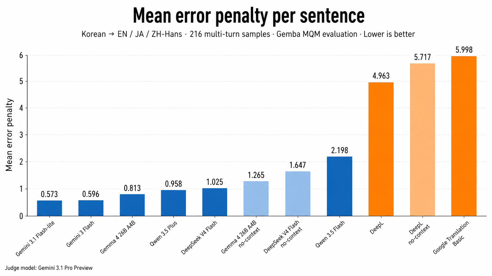

# Korean Multi-turn Context Translation Benchmark

**Benchmark run:** 2026-04-29  
**Evaluation:** GEMBA-MQM-based evaluation adapted for Korean multi-turn context translation

A Korean multi-turn context translation benchmark comparing LLM systems with conventional commercial translation services. The benchmark covers Korean source-side conversational context translation into English, Japanese, and Simplified Chinese.

The benchmark package combines the full dataset and authoring assets with GEMBA-MQM-based judge prompts. It also provides the participant registry, public result tables, and an advanced reproduction runner.

## Key Findings

- In Korean multi-turn translation settings, LLM systems showed an advantage over conventional commercial translation services.
- Within LLM systems, using conversational context improved translation quality compared with no-context baselines.

## Leaderboard

Primary score: raw mean penalty from the GEMBA-MQM-based evaluation. Lower is better.



| Rank | System | Mean penalty | Samples | Caveat |
| ---: | --- | ---: | ---: | --- |
| 1 | Gemini 3.1 Flash-lite | 0.573 | 648 | Fully valid |
| 2 | Gemini 3 Flash | 0.596 | 648 | Fully valid |
| 3 | Gemma 4 26B A4B | 0.813 | 648 | Fully valid |
| 4 | Qwen 3.5 Plus | 0.958 | 648 | Fully valid |
| 5 | DeepSeek V4 Flash | 1.025 | 648 | Fully valid |
| 6 | Gemma 4 26B A4B, no-context baseline | 1.265 | 648 | Fully valid |
| 7 | DeepSeek V4 Flash, no-context baseline | 1.647 | 648 | Fully valid |
| 8 | Qwen 3.5 Flash | 2.198 | 648 | Fully valid |
| 9 | DeepL, context | 4.963 | 644 | Reuse-only partial row |
| 10 | DeepL, no context | 5.717 | 644 | Reuse-only partial row |
| 11 | Google Cloud Translation Basic | 5.998 | 648 | Fully valid |

See `reports/` and `docs/results.md` for full slices by target language, context expectation, and context behavior.

## What This Benchmark Measures

- Korean source utterances with one to three prior context turns.
- Required-context cases test whether systems recover references, complete ellipsis, preserve register, resolve pragmatic intent, and handle addressivity.
- Ignore-context cases test whether systems avoid being misled by topic shifts, false leads, or nonliteral metadata traps.
- English, Japanese, and Simplified Chinese target translations.

## Dataset Summary

- Dataset ID: `gemba-mqm-context-v1`
- Source language: Korean
- Target languages: English, Japanese, Simplified Chinese
- Runtime samples: 216 Korean source items, evaluated across three target languages
- Public runtime data: `data/datasets/gemba-mqm-context-v1/runtime.json`
- Public authoring assets: `data/datasets/gemba-mqm-context-v1.authoring/`

## Reproduction

Full reruns require paid provider APIs, credentials, and a judge model.

```bash
npm install
cp .env.example .env
npm run bench:cli -- \
  --benchmark-config data/benchmarks/gemba-mqm-context-v1-gemini-context-v2.json \
  --participants gemini-3.1-flash-lite,gemini-3-flash,gemma-4-26b-openrouter \
  --judge-model gemini-3.1-pro-preview \
  --translation-concurrency-per-model 1 \
  --judge-concurrency 6
```

For detailed setup, see `docs/reproducibility.md`.

## Caveats

- The automated judge used Gemini 3.1 Pro; judge-model bias may have favored Gemini- and Gemma-family systems.
- DeepL rows are reuse-only partial rows and are not complete benchmark runs.

## Documentation

- `docs/methodology.md` — benchmark design and scoring scope
- `docs/dataset.md` — dataset schema and authoring process
- `docs/evaluation.md` — GEMBA-MQM-based judging details
- `docs/results.md` — detailed result analysis
- `docs/cost-analysis.md` — cost/value assumptions
- `docs/limitations.md` — interpretation limits
- `docs/reproducibility.md` — setup and runner instructions
- `docs/third-party-notices.md` — third-party attribution

## License

Code written for this benchmark is licensed under MIT. Dataset and public report artifacts are licensed under CC BY 4.0; see `data/LICENSE`. Vendored third-party material under `vendor/` keeps its original upstream license; see `docs/third-party-notices.md`.
