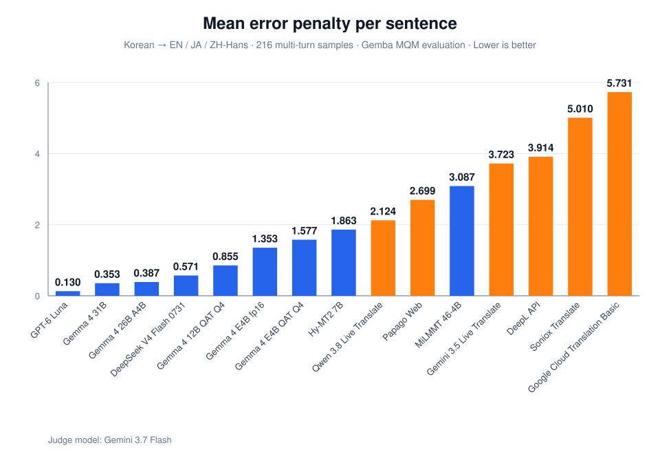
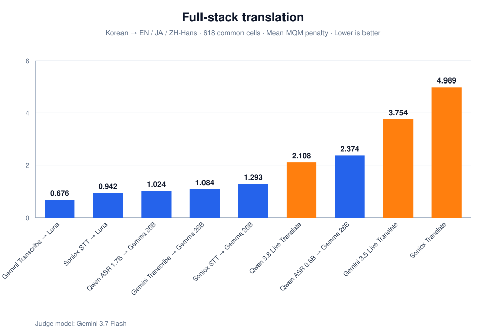
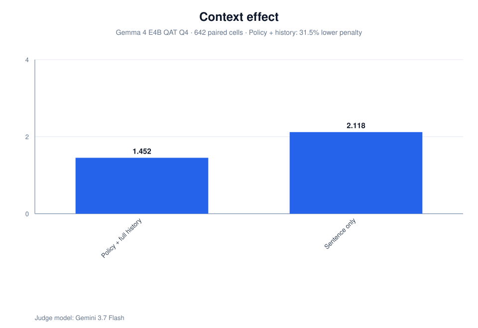

# Korean Multi-turn Context Translation Benchmark

GEMBA-MQM-based benchmark for Korean multi-turn context translation — LLMs vs. commercial translation services, including audio-native speech-to-speech translation.

- Korean conversational utterances (1–3 prior context turns) translated into English, Japanese, and Simplified Chinese
- Tests both required-context recovery (referents, ellipsis, register) and irrelevant-context rejection (topic shifts, false leads)
- Three main experiments on one frozen dataset: integrated system comparison, speech-input full-stack translation, and paired context effects

## Main Experiments (2026-09)

216 Korean items × 3 target languages = 648 expected cells per system. Primary score: raw mean MQM penalty — lower is better.

### Experiment 1 — 15-System Integrated Comparison

- **Full details:** [Here](experiments/2026-09-integrated-15-system/)
- **Setup:** 12 text-input systems + 3 direct speech-translation systems, extending the previous comparison with GPT-6 Luna, Qwen 3.8 Live Translate, and Soniox Translate.

**Key findings:**

- GPT-6 Luna leads (0.130); Gemma 4 31B follows (0.353). Best commercial MT: Papago (2.699).
- Gemma 4 12B QAT Q4 is the strongest local arm (0.855).
- Qwen 3.8 leads the three direct speech translators (2.124). Speech scores include recognition errors.



The chart includes three additional teal bars for the speech systems' current-utterance CER ≤ 5% subsets, sorted alongside the full results. These use system-specific qualifying cells, not a shared subset. Means in the table below use all valid judgments per system. The [common-cell report](experiments/2026-09-integrated-15-system/reports/summary-overall.penalty.common-cell.json) compares 612 matched cells and keeps the same ordering; the text-only view excludes the three speech systems.

| Rank | System | Input | Mean penalty | Samples |
| ---: | --- | --- | ---: | ---: |
| 1 | GPT-6 Luna | Text | 0.130 | 648 |
| 2 | Gemma 4 31B | Text | 0.353 | 648 |
| 3 | Gemma 4 26B A4B | Text | 0.387 | 648 |
| 4 | DeepSeek V4 Flash 0731 | Text | 0.571 | 648 |
| 5 | Gemma 4 12B QAT Q4 | Text | 0.855 | 648 |
| 6 | Gemma 4 E4B fp16 | Text | 1.353 | 648 |
| 7 | Gemma 4 E4B QAT Q4 | Text | 1.577 | 648 |
| 8 | Hy-MT2 7B | Text | 1.863 | 648 |
| 9 | Qwen 3.8 Live Translate | Speech | 2.124 | 647 |
| 10 | Papago Web | Text | 2.699 | 648 |
| 11 | MiLMMT 46-4B | Text | 3.087 | 647 |
| 12 | Gemini 3.5 Live Translate | Speech | 3.723 | 638 |
| 13 | DeepL API | Text | 3.914 | 642 |
| 14 | Soniox Translate | Speech | 5.010 | 630 |
| 15 | Google Cloud Translation Basic | Text | 5.731 | 648 |

#### Speech translation — current-utterance CER ≤ 5%

Separate results for cells whose recognized **current utterance** has a character error rate (CER) of **5% or less**, using valid MQM judgments from the [audio-ASR report](experiments/2026-09-integrated-15-system/reports/audio-asr.json). Lower mean penalty is better.

| System | Mean penalty (CER ≤ 5%) | Samples |
| --- | ---: | ---: |
| Qwen 3.8 Live Translate | 1.392 | 286 |
| Gemini 3.5 Live Translate | 2.991 | 223 |
| Soniox Translate | 3.473 | 355 |

Each system uses its own qualifying cells, not a shared subset. The filter does not require context-audio CER ≤ 5%; these are conditional results, not ASR-free translation scores.

### Experiment 2 — Full-Stack Translation

- **Full details:** [Here](experiments/2026-09-fullstack/)
- **Setup:** Korean speech → target-language text: 6 ASR→LLM pipelines + the same 3 direct speech translators from Experiment 1. TTS output is not evaluated.

**Key findings:**

- Gemini Transcribe → Luna leads (0.676), followed by Soniox pure STT → Luna (0.942).
- With Gemma 26B, Qwen3-ASR 1.7B and Gemini Transcribe are close (1.024 / 1.084).
- Soniox performs better as pure STT feeding an LLM than as a direct translator.



Ranking uses the same **618 successfully judged cells** across all nine systems. Samples show each system's full valid coverage out of 648.

| Rank | Speech → translation | Architecture | Mean penalty (n=618) | Full valid / 648 |
| ---: | --- | --- | ---: | ---: |
| 1 | Gemini 3.5 Transcribe → GPT-6 Luna · none | ASR→LLM | 0.676 | 648 |
| 2 | Soniox pure STT → GPT-6 Luna · none | ASR→LLM | 0.942 | 648 |
| 3 | Qwen3-ASR 1.7B → Gemma 4 26B | ASR→LLM | 1.024 | 648 |
| 4 | Gemini 3.5 Transcribe → Gemma 4 26B | ASR→LLM | 1.084 | 648 |
| 5 | Soniox pure STT → Gemma 4 26B | ASR→LLM | 1.293 | 648 |
| 6 | Qwen 3.8 Live Translate | Direct speech | 2.108 | 647 |
| 7 | Qwen3-ASR 0.6B → Gemma 4 26B | ASR→LLM | 2.374 | 647 |
| 8 | Gemini 3.5 Live Translate | Direct speech | 3.754 | 638 |
| 9 | Soniox Translate | Direct speech | 4.989 | 630 |

Gemini Transcribe is distinct from Gemini Live Translate. Soniox→LLM uses the latest pure-STT transcripts. Scores include ASR error propagation; the reference remains the canonical Korean text.

**Latency:** ASR and LLM stages were collected separately, so integrated end-to-end latency is not measured. Direct speech session times include realtime-paced context/current audio. [Timing report](experiments/2026-09-fullstack/reports/fullstack-latency.json).

### Experiment 3 — Context Effect

- **Full details:** [Here](experiments/2026-08-gemini35-live-10p-highjudge/ablation/)
- **Setup:** Same Gemma 4 E4B QAT Q4, sentence-only vs. policy + full conversation history.
- **Key finding:** Policy + history reduces mean penalty by **31.5%** on 642 valid pairs: 236 improved, 134 worsened, 272 tied.



| Condition | Mean penalty | Paired samples |
| --- | ---: | ---: |
| Sentence only | 2.118 | 642 |
| Policy + full history | 1.452 | 642 |

The comparison changes both history and translation policy, not history alone. [Slices](experiments/2026-08-gemini35-live-10p-highjudge/ablation/#slices) cover required/irrelevant context, target language, and context length.


## Previous Experiments

- **2026-08:** [12-system comparison](experiments/2026-08-gemini35-live-10p-highjudge/). Gemma 4 31B led (0.353); this is the base comparison extended in Experiment 1.
- **2026-04, archived:** [Original context-v2 experiment](experiments/2026-04-gemini-context-v2-archived/). Gemini 3.1 Flash-lite led (0.573); a separate historical result.

## Dataset

- `gemba-mqm-context-v1` — 216 Korean items × 3 target languages (fingerprint `9ab9e987…5110`)
- Runtime data: `data/datasets/gemba-mqm-context-v1/runtime.json` — authoring assets alongside

## Reproduction

```bash
npm install && cp .env.example .env
npm run bench:cli -- \
  --benchmark-config data/benchmarks/gemba-mqm-context-v1-milmmt-e4b.json \
  --participants gemini35-live-translate-two-voice \
  --judge-model google/gemini-3.7-flash:batch \
  --judge-backend openrouter-batch \
  --judge-reasoning-effort high
```

This is an example of the earlier runner setup. The published September collections and their source-adapter requirements are documented in [Reproducibility](docs/reproducibility.md#published-main-experiments).

- Full reruns need provider API keys, the two-voice TTS asset pipeline, and a judge model — [Here](docs/reproducibility.md)

## Documentation

- Experiment 1 — integrated comparison: [Here](experiments/2026-09-integrated-15-system/)
- Experiment 2 — full-stack translation: [Here](experiments/2026-09-fullstack/)
- Experiment 3 — context effect: [Here](experiments/2026-08-gemini35-live-10p-highjudge/ablation/)
- Methodology &amp; experiment comparison: [Here](docs/methodology.md)
- Result analysis: [Here](docs/results.md)
- Evaluation (GEMBA-MQM judging): [Here](docs/evaluation.md)
- Dataset schema &amp; authoring: [Here](docs/dataset.md)
- Limitations: [Here](docs/limitations.md)
- Reproducibility: [Here](docs/reproducibility.md)

## License

- Code: MIT
- Dataset &amp; public reports: CC BY 4.0 (`data/LICENSE`)
- Vendored GEMBA: upstream license (`docs/third-party-notices.md`)

